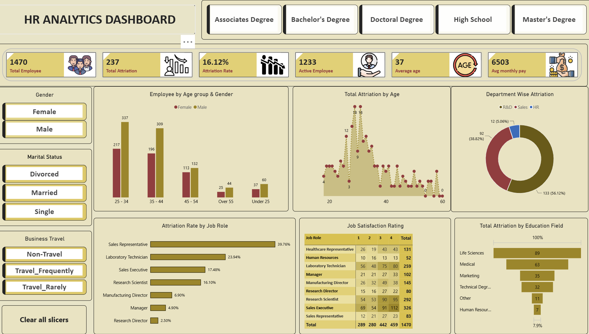

# HR_Analytics_Dashboard
# HR Analytics Dashboard

An interactive **HR Analytics Dashboard built using Microsoft Power BI** to analyze employee data and provide meaningful insights into workforce demographics, attrition, and employee trends.

## 📸 Dashboard Screenshot

**View Screenshot:**
https://github.com/kirtibhvasar17/HR_Analytics_Dashboard/blob/main/snapshot_HR_Dashboard.png

## 📊 Key Insights

* Total Employees
* Employee Attrition
* Attrition Rate
* Department-wise Analysis
* Gender-wise Analysis
* Job Role Analysis
* Employee Demographics
* Salary and Experience Analysis
* Interactive slicers and filters

## 🛠️ Tools & Technologies

* Microsoft Power BI
* Power Query
* DAX
* Data Cleaning
* Data Visualization

## 🎯 Objective

The objective of this project is to analyze HR data and provide interactive visual insights that support **data-driven workforce and HR decisions**.

## 📁 Project Files

* `HR Analytics Dashboard Project.pbit`
* `snapshot_HR_Dashboard.png`

## 👩‍💻 Skills Demonstrated

**Power BI | DAX | Power Query | Data Analysis | Data Visualization | HR Analytics | Dashboard Development**
